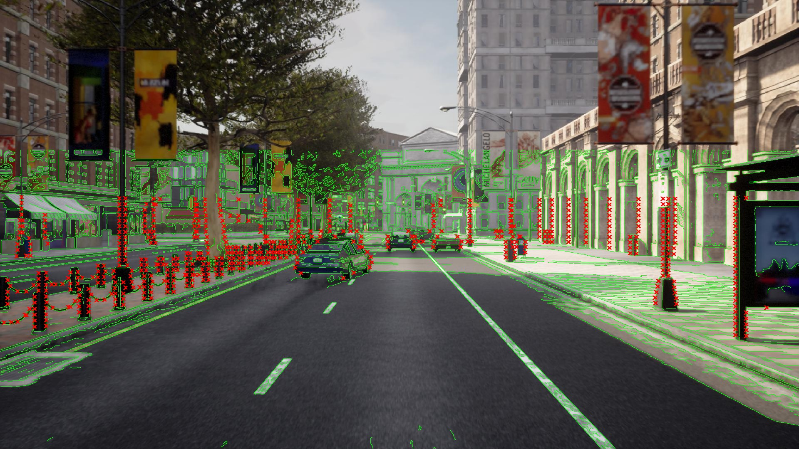
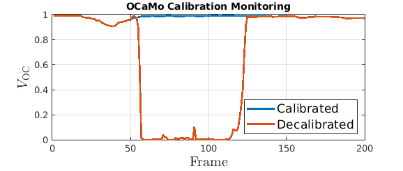
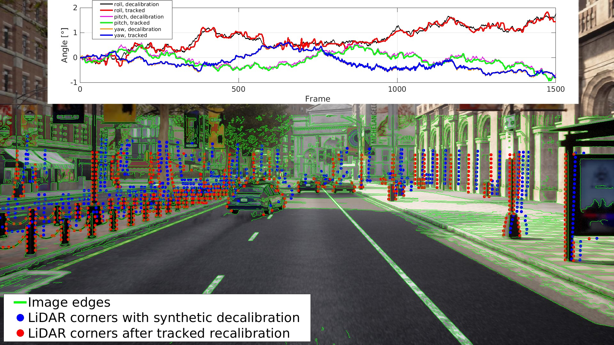
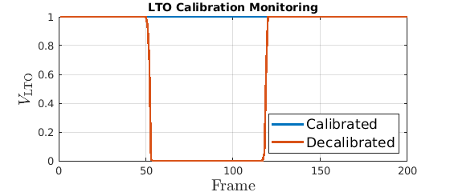
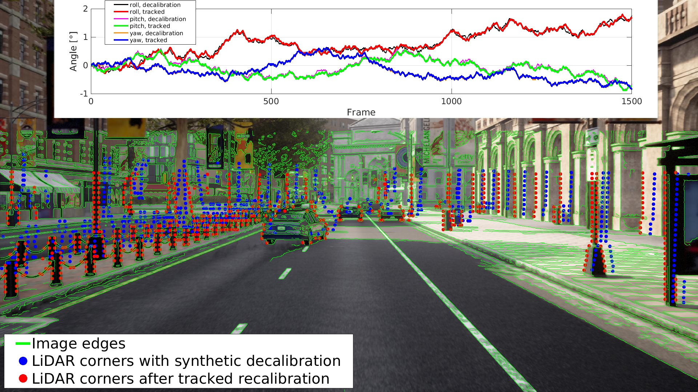

# Simple Projection
Please, run the script `carla_projection.m`. The resulting image shows the detected canny edges (green curves) and the reference projection of detected LiDAR corners (red crosses).

We have prepared several MATLAB scripts to test inference on the CARLA dataset snippet. Please see below for the expected results. 

# OCaMo Inference

## Calibration Monitoring
Please, run the script `ocamo_monitoring.m` to see an example of calibration monitoring on the CARLA data. It runs the OCaMo monitoring (see Sec. III.C of the paper) on CARLA data without and with decalibration (between frames 51 and 110). The visualization shows the OCaMo validity index (13) on both scenarios.

## Drift Tracking

Besides the calibration monitoring, we have also prepared an example of calibration drift tracking in the script `ocamo_drift_tracking.m`. A cumulative synthetic drift of +/- 0.0005 rad is applied to the parameters and the tracker (see Sec. III.C of the paper) should be able to follow such a change. You can see the tracked parameters in the graph below. There is also visualized the projection of decalibrated and recalibrated LiDAR corners at the last frame (1500). 

For more examples of drift tracking on real data, please see the supplementary material at: https://cmp.felk.cvut.cz/~moravj34/ocamo/.

# LTO Inference

## Calibration Monitoring

The LTO calibration monitoring example is prepared in the script `lto_monitoring.m`. The monitoring results on calibrated and decalirated (between frames 51 and 110) sequences are also shown below. It shows that the LTO is much more stable (on these large decalibrations) in monitoring compared to OCaMo above.

## Drift Tracking

The LTO drift tracking example is prepared in the script `lto_drift_tracking.m`. A small, cumulative synthetic drift of +/- 0.0005 rad is applied to the parameters and the LTO tracker should be able to follow such a change. You can see the tracked parameters in the graph below. There is also visualized the projection of decalibrated and recalibrated LiDAR corners at the last frame (1500).

