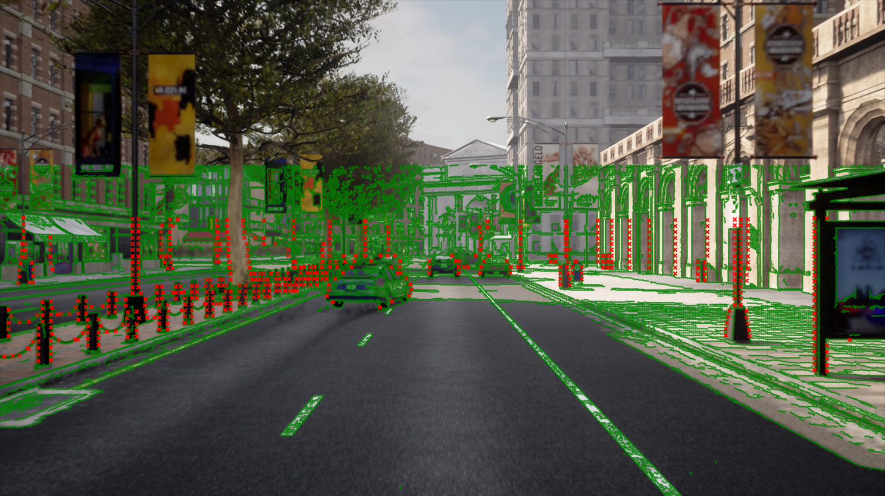
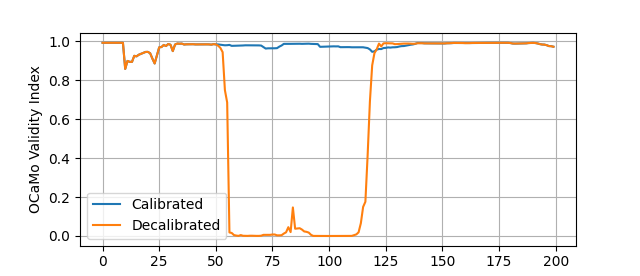
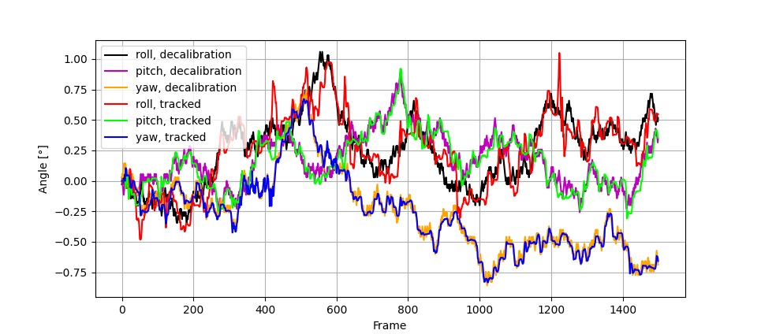
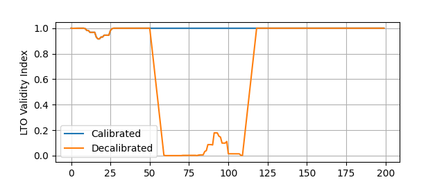
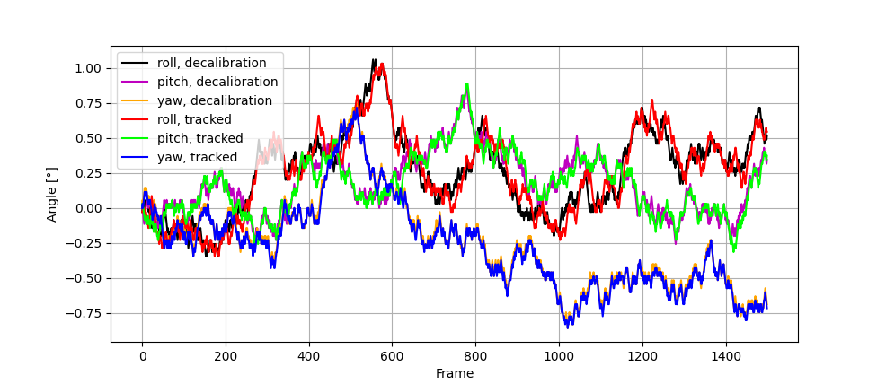

# Simple Projection
Please, run the script `carla_projection.py`. The resulting image shows the detected canny edges (green curves) and the reference projection of detected LiDAR corners (red crosses).

We have prepared several Python scripts to test inference on the CARLA dataset snippet. Please see below for the expected results. 

As the canny edge detector is different from the MATLAB version (see `matlab/inference`), the inference methods will not have an identical result. On the top of that, as the preprocessing and model parameters were trained in MATLAB, the perfomance will most likely be poorer as well.

# OCaMo Inference

## Calibration Monitoring
Please, run the script `ocamo_monitoring.py` to see an example of calibration monitoring on the CARLA data. It runs the OCaMo monitoring (see Sec. III.C of the paper) on CARLA data without and with decalibration (between frames 51 and 110). The visualization shows the OCaMo validity index (13) in each scenario.

## Drift Tracking

Besides the calibration monitoring, we have also prepared an example of calibration drift tracking in the script `ocamo_drift_tracking.py`. A cumulative synthetic drift of +/- 0.0005 rad is applied to the parameters and the tracker (see Sec. III.C of the paper) should be able to follow such a change. You can see the tracked parameters in the graph below.

For more examples of drift tracking on real data, please see the supplementary material at: https://cmp.felk.cvut.cz/~moravj34/ocamo/.

# LTO Inference

## Calibration Monitoring

We have prepared LTO monitoring as well in the script `lto_monitoring_tracking.py`, which is based on rotational perturbations only (27 vs. 729 evaluations in the paper). The full LTO results can be seen in the MATLAB inference directory (see `matlab/inference/README.md`). You can see (in the figure below) that the detection of decalibration (between frames 50 and 110) works quite well with 27 evaluations only. These results would probably be even better, if the hyper-parameters were trained for python as well.

## Drift Tracking
An example of LTO drift tracking on the CARLA data snippet can be found in the script `lto_drift_tracking.py`. A cumulative synthetic drift of +/- 0.0005 rad is applied to the rotational parameters and the LTO tracker should be able to follow such a change. You can see the tracked parameters in the graph below.

